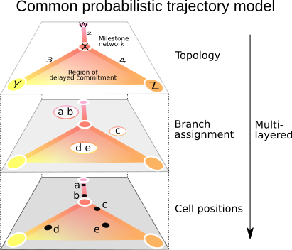
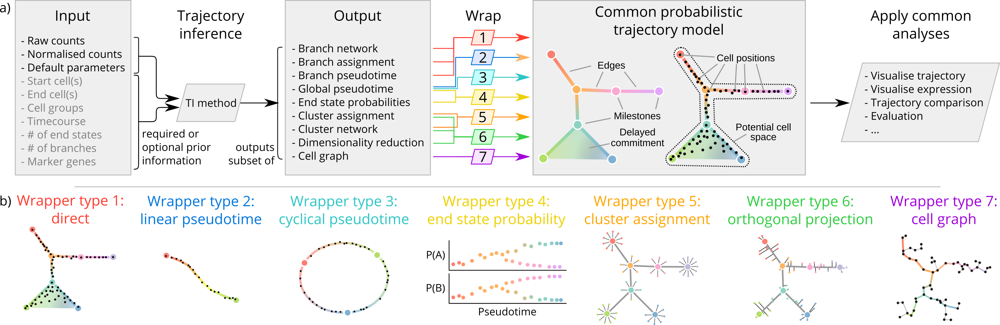
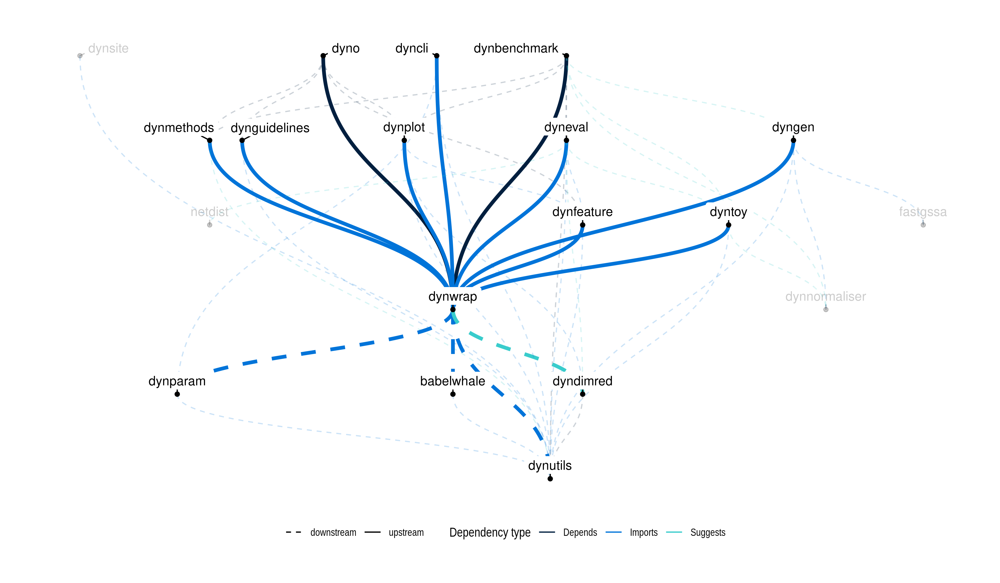

dynwrap: Representing and Inferring Single-Cell Trajectories
================

<!-- README.md is generated from README.Rmd. Please edit that file -->
<!-- badges: start -->

[**Tutorials**](https://dynverse.org) [**Reference
documentation**](https://dynverse.org/reference/dynwrap/)
<!-- badges: end -->

**dynwrap** contains the code for a common model of single-cell
trajectories. The package can:

-   Wrap the input data of a trajectory inference method, such as
    expression and prior information
-   Run a trajectory inference method in R, in a docker container or a
    singularity container
-   Wrap the output of a trajectory inference method, such as the
    pseudotime, a clustering or a branch network, and convert it into a
    common trajectory model
-   Further postprocess and adapt the trajectory model, such as
    labelling the milestones and rooting the trajectory

Documentation and the API reference for dynwrap can be found at the
dyvnerse documentation website: <https://dynverse.org/> .

dynwrap was used to wrap 50+ trajectory inference method within docker
containers in [dynmethods](https://github.com/dynverse/dynmethods).

The advantage of using a common model is that it allows:

-   Comparison between a prediction and a gold standard, eg. using
    [dyneval](https://github.com/dynverse/dyneval)
-   Comparing two predictions
-   Easily visualise the trajectory, eg. using
    [dynplot](https://github.com/dynverse/dynplot)
-   Extracting relevant features/genes, eg. using
    [dynfeature](https://github.com/dynverse/dynfeature)

## Latest changes

Check out `news(package = "dynwrap")` or [NEWS.md](NEWS.md) for a full
list of changes.

<!-- This section gets automatically generated from inst/NEWS.md -->

### Recent changes in dynwrap 1.2.3

-   MINOR CHANGE: Fixes to metadata (documentation, citation entry,
    broken links).

### Recent changes in dynwrap 1.2.2

-   MAJOR CHANGE `convert_milestone_percentages_to_progressions()`:
    Rewrite implementation to attain significant speedup.

-   MINOR CHANGE `infer_trajectory()`: Infer command (Rscript/python)
    from file extension if possible and avoid using shebang to execute
    script, because R CMD check for R 4.0 puts Rscript and R dummy
    executables on the path before R CMD check. This means
    `#!/usr/bin/env Rscript` does not work anymore.

-   MINOR CHANGE `add_feature_importance()`: Add a function for adding
    feature importance scores to a trajectory.

-   BUG FIX `project_waypoints()`: Rename milestone waypoints such that
    the names are unique.

-   BUG FIX `infer_trajectory()`: Fix error message printing.

-   BUG FIX: `dyndimred` is used conditionally.

-   BUG FIX: `wrap_expression()` and `add_expression()`: Do not override
    feature_info when it already exists in dataset.

## Dynverse dependencies

<!-- Generated by "update_dependency_graphs.R" in the main dynverse repo -->

