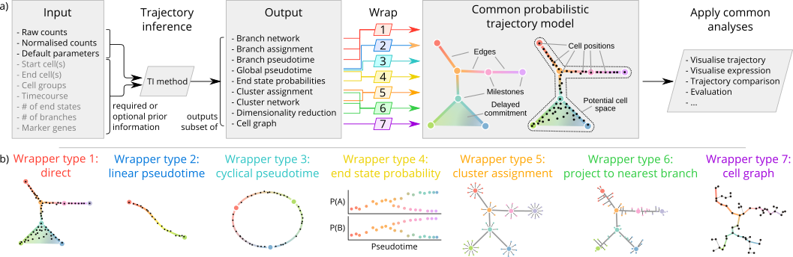

<!-- README.md is generated from README.Rmd. Please edit that file -->

# Tools for inferring and wrapping single-cell trajectories

**dynwrap** contains the code for a common model of single-cell
trajectories. The package can:

  - Wrap the input data of a trajectory inference method, such as
    expression and prior information
  - Run a trajectory inference method in R, in a docker container or a
    singularity container
  - Wrap the output of a trajectory inference method, such as the
    pseudotime, a clustering or a branch network, and convert it into a
    common trajectory model
  - Further postprocess the trajectory model, such as labelling the
    milestones and rooting the trajectory

dynwrap was used to wrap 50+ trajectory inference method within docker
containers in [dynmethods](https://github.com/dynverse/dynmethods).

The advantage of using a common model is that it allows:

  - Comparison between a prediction and a gold standard, eg. using
    [dyneval](https://www.github.com/dynverse/dyneval)
  - Comparing two predictions
  - Easily visualise the trajectory, eg. using
    [dynplot](https://www.github.com/dynverse/dynplot)
  - Extracting relevant features/genes, eg. using
    [dynfeature](https://www.github.com/dynverse/dynfeature)

## Latest changes

Check out `news(package = "dynfeature")` or [NEWS.md](inst/NEWS.md) for
a full list of
changes.

<!-- This section gets automatically generated from inst/NEWS.md, and also generates inst/NEWS -->

### Latest changes in dynwrap 0.3.0 (unreleased)

  - MINOR CHANGE: Add metadata on the different wrapper types
    implemented in dynwrap.

  - CLEAN UP: remove `plot_fun` from `create_ti_method()`.

  - MINOR CHANGE: Replace `mc_cores` with more flexible `map_fun`.

  - MINOR CHANGE: Renamed `create_ti_method()` to
    `create_ti_method_r()`.

  - MAJOR CHANGE: Reworked `create_ti_method_r()` and
    `create_ti_method_container()` and underlying functions for
    executing a method on a dataset.

### Latest changes in dynwrap 0.2.0 (29-10-2018)

  - BUG FIX: Fix incorrect calculation of milestone percentage during
    trajectory simplification. Occurs only in a rare edge case, namely
    when the order of the milestones in the milestone network is very
    different from the order of the milestone ids (0475e94).

  - BUG FIX: Fix suggested dependencies not being installed in the
    dynwrap containers (\#100).

  - FEATURE REMOVAL: Remove feather data format because it’s not being
    used and creates dependency issues every now and again.

  - BUG FIX: `devtools:::shim_system.file()` has been moved to
    `pkgload:::shim_system.file()`.

  - TESTING: Solve issue with the unit tests by not using any helpers.

  - MINOR CHANGE: Have docker images build from <dynwrap@devel>.

  - BUG FIX: Remove `option(echo = FALSE)` from .Rprofile in recipes
    because some packages directly rely on standard output from R, so
    printing the command wreaks havoc.
