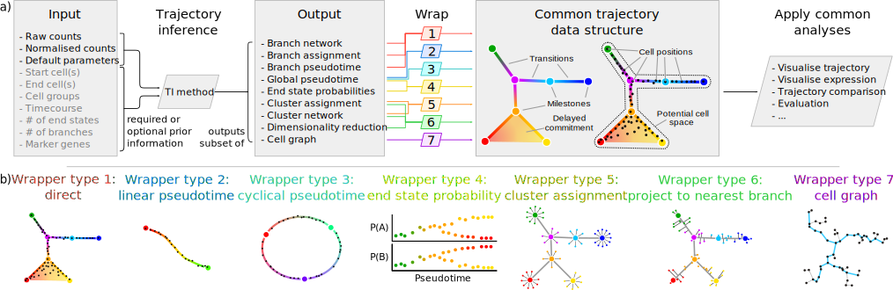

 

# Tools for inferring and wrapping single-cell trajectories

**dynwrap** contains the code for a common model of single-cell trajectories. The package can

* Wrap the input data of a TI method, such as expression and prior information
* Run a TI method locally or in a docker
* Wrap the output of a TI method, such as the pseudotime, a clustering or a branch network, and convert it into a common trajectory model
* Further postprocess the output, such as labelling milestones and rooting the trajectory

The advantage of using a common model is that it allows

* Comparison between a prediction and a gold standard, eg. using [dyneval](https://www.github.com/dynverse/dyneval)
* Comparing two predictions
* Easily visualise the trajectory, eg. using [dynplot](https://www.github.com/dynverse/dynplot)
* Extracting relevant features/genes, eg. using [dynfeature](https://www.github.com/dynverse/dynfeature)
