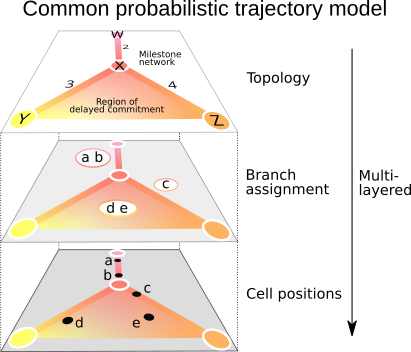
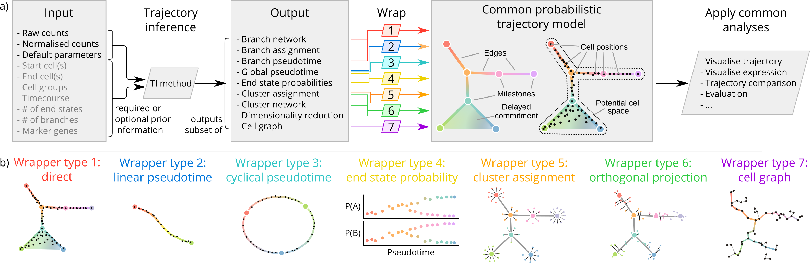
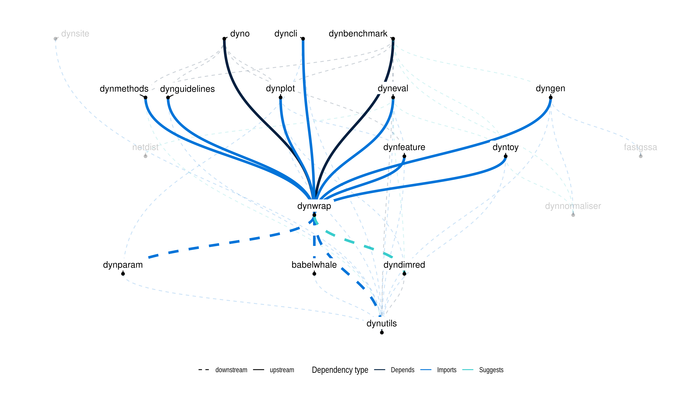

dynwrap: Representing and Inferring Single-Cell Trajectories
================

<!-- README.md is generated from README.Rmd. Please edit that file -->
<!-- badges: start -->

[**Tutorials**](https://dynverse.org) [**Reference
documentation**](https://dynverse.org/reference/dynwrap/)
<!-- badges: end -->

**dynwrap** contains the code for a common model of single-cell
trajectories. The package can:

- Wrap the input data of a trajectory inference method, such as
  expression and prior information
- Run a trajectory inference method in R, in a docker container or a
  singularity container
- Wrap the output of a trajectory inference method, such as the
  pseudotime, a clustering or a branch network, and convert it into a
  common trajectory model
- Further postprocess and adapt the trajectory model, such as labelling
  the milestones and rooting the trajectory

Documentation and the API reference for dynwrap can be found at the
dyvnerse documentation website: <https://dynverse.org/> .

dynwrap was used to wrap 50+ trajectory inference method within docker
containers in [dynmethods](https://github.com/dynverse/dynmethods).

The advantage of using a common model is that it allows:

- Comparison between a prediction and a gold standard, eg. using
  [dyneval](https://github.com/dynverse/dyneval)
- Comparing two predictions
- Easily visualise the trajectory, eg. using
  [dynplot](https://github.com/dynverse/dynplot)
- Extracting relevant features/genes, eg. using
  [dynfeature](https://github.com/dynverse/dynfeature)

## Latest changes

Check out `news(package = "dynwrap")` or [NEWS.md](NEWS.md) for a full
list of changes.

<!-- This section gets automatically generated from inst/NEWS.md -->

### Recent changes in dynwrap 1.2.5

- BUG FIX `convert_definition()`: Fix for purrr having deprecated
  `invoke` in favour of `exec` (PR \#166).

### Recent changes in dynwrap 1.2.4

- Resubmission after babelwhale was removed from CRAN.

- MINOR CHANGE: Added `@return` documentation to all functions.

## Dynverse dependencies

<!-- Generated by "update_dependency_graphs.R" in the main dynverse repo -->

