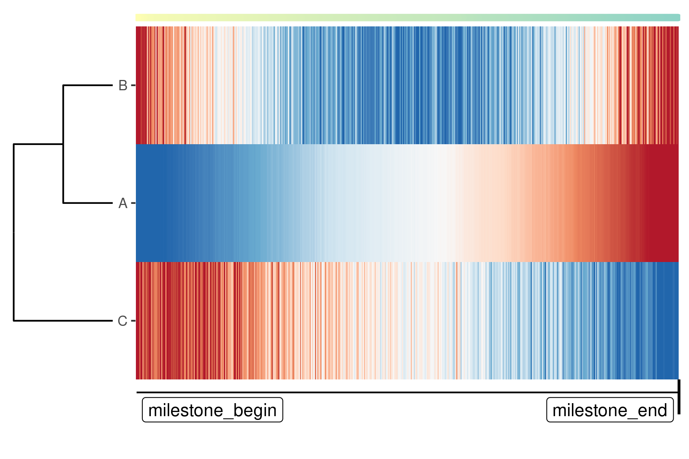

```{r, include = FALSE}
dir <- tempdir()
knitr::opts_knit$set(root.dir = normalizePath(tempdir(), winslash = '/'))

# dyncli is not installed on travis or CRAN, so don't run some parts of the vignette there
NOT_CRAN <- Sys.getenv("NOT_CRAN") == "" || identical(tolower(Sys.getenv("NOT_CRAN")), "true")
NOT_TRAVIS <- !identical(tolower(Sys.getenv("TRAVIS")), "true")
```

```{r setup}
library(dynwrap)
```

An alternative to wrapping a script inside R, is to wrap it using an external script. Because this does not provide any dependency management, this is not really useful for method end-users, but rather as a way to easily develop a TI method and to ultimately step up towards [containerised wrapping](../create_ti_method_container).

Similarly as a wrapper written in R, you'll need to provide both a definition (= a _definition.yml_) and a way to run the methods (= a script).

## _definition.yml_

The definition has the same hierarchical structure as used by the `definition()` function. A minimal example

<div class="filename">definition.yml</div>
```{r, echo = FALSE}
definition_string <- paste0(readLines(system.file("examples/script/definition.yml", package = "dynwrap")), "\n", collapse = "")

readr::write_file(definition_string, "definition.yml")
knitr::asis_output(paste0("```yaml\n", definition_string, "\n```"))
```

You can use our template _definition.yml_ to see all the different possibilities of what can be included in the definition: https://github.com/dynverse/dynmethods/tree/master/template_container . It may also be useful to check out  some of the wrappers in dynmethods, e.g.: https://github.com/dynverse/ti_paga/blob/master/definition.yml

## Running script

A running script reads in the data, creates a trajectory, and again writes the trajectory to a file. To do the loading and writing tasks, we provide helper libraries for R and python: [dyncli](https://github.com/dynverse/dyncli) and [dynclipy](https://github.com/dynverse/dynclipy).

The wrapper script will typically have the following structure:

- A shebang, such as `#!/usr/bin/env Rscript` or `#!/usr/bin/env python`
- A call to dyncli(py) to load in the data, such as `dataset <- dyncli::main()` or `dataset = dynclipy.main()`
- All you need to infer the trajectory
- Constructing the trajectory model using [any of the wrapping methods](../create_ti_method_wrappers)
- A call to dyncli(py) to write the data, such as `dyncli::write_output(trajectory)` or `trajectory.write_output()`

A minimal example script for R:

<div class="filename">run.R</div>
```{r, echo = FALSE}
run_r_string <- paste0(readLines(system.file("examples/script/run.R", package = "dynwrap")), "\n", collapse = "")

readr::write_file(run_r_string, "run.R")
knitr::asis_output(paste0("```r\n", run_r_string, "\n```"))
```

Make sure this script is executable!

```{bash, eval=NOT_CRAN && NOT_TRAVIS}
chmod +x run.R
```

and for Python:

<div class="filename">run.py</div>
```{r, echo = FALSE}
run_py_script <- paste0(readLines(system.file("examples/script/run.py", package = "dynwrap")), "\n", collapse = "")

readr::write_file(run_py_script, "run.py")
knitr::asis_output(paste0("```python\n", run_py_script, "\n```"))
```

## Testing it out

```{r, eval=FALSE}
method <- create_ti_method_definition("definition.yml", "run.R")
dataset <- dynwrap::example_dataset
trajectory <- infer_trajectory(dataset, method(), verbose = TRUE)
```


If you have dynplot installed, you can also plot the trajectory:
```{r, eval=FALSE}
library(dynplot)
# for now, install from github using:
# remotes::install_github("dynverse/dynplot")
plot_graph(trajectory)
plot_heatmap(trajectory, expression_source = dataset$expression)
```


## Interactive development

With the debug parameter, it is possible to enter the script interactively. This makes it easier to develop TI method as you can just load in the input data, and code!

```{r, error = TRUE, eval = FALSE}
trajectory <- infer_trajectory(dataset, method(), debug = TRUE)
```

## Making your method available for other users

Wrapping a method inside a script does not have any dependency management, and is therefore only meant for development purposes. To deploy your method to other users, check out the [containerisation tutorial](../create_ti_method_container)!

## Wrapping a method without dyncli(py)

While using dyncli to load and save the data is the most straightforward when using R and python, it's also possible to skip these packages and do all the work yourself. Briefly you have to:

- Parse the arguments provided by dynwrap yourself, e.g. `--dataset input.h5`.
- Read in the hdf5 files generated by dynwrap
- Write the output file in the correct hdf5 format

If after this you're still convinced you want to do this, please contact us. We'll be able to provide some further documentation!

```{r, echo = FALSE}
temp_files <- c("run.R", "run.py", "definition.yml")
for (file in temp_files) {
  if (file.exists(file)) 
    file.remove(file)
}
```
